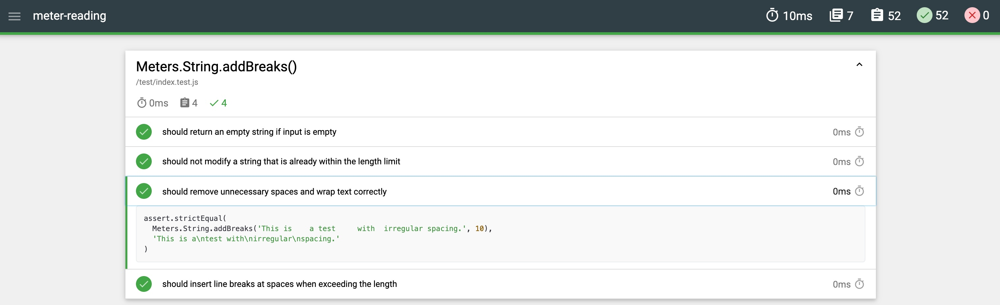

# meter-reading
Simulation of a utility meter reading app.

```bash
mkdir meter-reading
cd meter-reading
npm init -y
npm install webpack webpack-cli --save-dev
```

```bash
npm install --save lodash
```

```bash
npx webpack
```

```bash
npx webpack --config webpack.config.js
```

```plaintext
/meter-reading
│── /src
├── templates/
│   │   ├── index.hbs
│   │   ├── partials/
│   │   │   ├── header.hbs
│   │   │   ├── footer.hbs
│   ├── /components       # Reusable UI components
│   ├── /services         # API services or business logic classes
│   ├── /utils            # General utility functions/helpers
│   ├── /styles           # CSS/SASS stylesheets
│   ├── index.js          # Main entry file
│── /dist                 # Webpack output folder
│── webpack.config.js     # Webpack configuration
│── package.json          # Project dependencies
```

```shell
npm install webpack webpack-cli webpack-dev-server --save-dev
npm install handlebars handlebars-loader html-webpack-plugin --save-dev
npm install bootstrap


```

```shell
npm install dotenv-webpack --save-dev
```
## Mochawesome

Mochawesome is a custom reporter for use with the Javascript testing framework, mocha. It runs on Node.js (>=10) and works in conjunction with mochawesome-report-generator to generate a standalone HTML/CSS report to help visualise your test runs.

[](./docs/mochawesome.jpg)

---

[](https://github.com/standard/standard)
